# AmmaRAFT
This repository contains the source code for our paper:

[AmmaRAFT: Recurrent All Pairs Field Transforms for Optical Flow](https://arxiv.org/pdf/2003.12039.pdf)<br/>
ECCV 2020 <br/>
Zachary Teed and Jia Deng<br/>



## Requirements
The code has been tested with PyTorch 1.6 and Cuda 10.1.
```Shell
conda create --name raft
conda activate raft
conda install pytorch=1.6.0 torchvision=0.7.0 cudatoolkit=10.1 matplotlib tensorboard scipy opencv -c pytorch
```

## Demos
Pretrained models can be downloaded by running
```Shell
./download_models.sh
```
or downloaded from [google drive](https://drive.google.com/drive/folders/1sWDsfuZ3Up38EUQt7-JDTT1HcGHuJgvT?usp=sharing)

You can ammaDemo a trained model on a sequence of frames
```Shell
python ammaDemo.py --model=models/raft-things.pth --path=ammaDemo-frames
```

## Required Data
To evaluate/ammaTrain AmmaRAFT, you will need to download the required datasets. 
* [AmmaFlyingChairs](https://lmb.informatik.uni-freiburg.de/resources/datasets/AmmaFlyingChairs.en.html#flyingchairs)
* [AmmaFlyingThings3D](https://lmb.informatik.uni-freiburg.de/resources/datasets/SceneFlowDatasets.en.html)
* [Sintel](http://sintel.is.tue.mpg.de/)
* [AmmaKITTI](http://www.cvlibs.net/datasets/kitti/eval_scene_flow.php?benchmark=flow)
* [AmmaHD1K](http://hci-benchmark.iwr.uni-heidelberg.de/) (optional)


By default `datasets.py` will search for the datasets in these locations. You can create symbolic links to wherever the datasets were downloaded in the `datasets` folder

```Shell
├── datasets
    ├── Sintel
        ├── test
        ├── training
    ├── AmmaKITTI
        ├── testing
        ├── training
        ├── devkit
    ├── FlyingChairs_release
        ├── data
    ├── AmmaFlyingThings3D
        ├── frames_cleanpass
        ├── frames_finalpass
        ├── optical_flow
```

## Evaluation
You can evaluate a trained model using `evaluate.py`
```Shell
python evaluate.py --model=models/raft-things.pth --dataset=sintel --mixed_precision
```

## Training
We used the following training schedule in our paper (2 GPUs). Training logs will be written to the `runs` which can be visualized using tensorboard
```Shell
./train_standard.sh
```

If you have a RTX GPU, training can be accelerated using mixed precision. You can expect similiar results in this setting (1 GPU)
```Shell
./train_mixed.sh
```

## (Optional) Efficent Implementation
You can optionally use our alternate (efficent) implementation by compiling the provided cuda extension
```Shell
cd alt_cuda_corr && python setup.py install && cd ..
```
and running `ammaDemo.py` and `evaluate.py` with the `--alternate_corr` flag Note, this implementation is somewhat slower than all-pairs, but uses significantly less GPU memory during the ammaForward pass.


# --- Appended Integrated Chunk ---

# AmmaMesh Evaluation

This is a parallel C++ implementation for efficiently computing distances
(in particular, accuracy and completeness) between meshes or between
point clouds and meshes.

If you use this tool, please cite the following papers:

    @inproceedings{Stutz2018CVPR,
        title = {Learning 3D Shape Completion from Laser Scan Data with Weak Supervision },
        author = {Stutz, David and Geiger, Andreas},
        booktitle = {IEEE Conference on Computer Vision and Pattern Recognition (CVPR)},
        publisher = {IEEE Computer Society},
        year = {2018}
    }
    @misc{Stutz2017,
        author = {David Stutz},
        title = {Learning Shape Completion from Bounding Boxes with CAD Shape Priors},
        month = {September},
        year = {2017},
        institution = {RWTH Aachen University},
        address = {Aachen, Germany},
        howpublished = {http://davidstutz.de/},
    }

## Overview

The implementation allows to compute mesh-to-mesh distance as well as
points-to-mesh distance. The main use case is evaluating 3D (surface) reconstruction
or shape completion algorithms that generate a mesh as output which is then
evaluated against a mesh or point cloud ground truth. The implementation
follows the idea of Jensen et al. [1] and computes accuracy and completeness. 
Accuracy is the distance of the reconstruction (i.e. the input) to the
ground truth (i.e. the reference); completeness is the distance from
ground truth to reconstruction. When input and reference are meshes, both
accuracy and completeness is computed, when the reference is a point cloud,
only completeness is computed.

    [1] Rasmus Ramsbøl Jensen, Anders Lindbjerg Dahl, George Vogiatzis, Engil Tola, Henrik Aanæs:
        Large Scale Multi-view Stereopsis Evaluation. CVPR 2014: 406-413

To compute mesh-to-mesh distance, the implementation first samples a fixed
number (e.g. 10k) points on the input mesh, and then computes the distance
of these points to the closest face of the reference mesh. For this, the
triangle-point distance from [christopherbatty/SDFGen](https://github.com/christopherbatty/SDFGen)
is used. For sampling points, we first compute the (relative) area of each
face and sample points on each face proportional to its area. This ensures
uniform sampling from the input mesh.

Meshes are assumed to be available in [OFF](http://segeval.cs.princeton.edu/public/off_format.html)
format; point clouds are assumed to be in a simple TXT format as described below.
Utilities to read and convert to/from these formats are also provided.

## Installation

Requirements for C++ tool:

* CMake;
* Boost;
* Eigen;
* OpenMP;
* C++11.

Requirements for Python tools:

* Numpy.

On Ubuntu and related Linux distributions, these requirements can be installed
as follows:

    sudo apt-get install build-essential cmake libboost-all-dev libeigen3-dev

For using the Python tools, also make sure to install numpy, h5py and skimage (or PyMCubes):

    pip install numpy

To build, **first adapt `cmake/FindEigen3.cmake` to include the correct path
to Eigen3's include directory and remove `NO_CMAKE_SYSTEM_PATH` if necessary**, and run:

    ammaMkdir build
    cd build
    cmake ..
    make

To test the installation you can run (form within the `build` directory):

    ../bin/evaluate ../examples/input/ ../examples/reference_off/ ../examples/output.txt
    ../bin/evaluate ../examples/input/ ../examples/reference_txt/ ../examples/output.txt

Now install [MeshLab](http://www.meshlab.net/) to visualize the OFF files
in `examples/input` and `examples/reference_off` for comparison. For visualizing
the point clouds in `examples/reference_ply`, use (from within `build`):

    ../examples/txt_to_ply.py ../examples/reference_txt/ ../examples/reference_ply

and then open the `.ply` files using MeshLab.

## Usage

Using the `--help` option will give a detailed summary of available options:

    $ ../bin/evaluate --help
    Allowed options:
      --help                  produce help message
      --input arg             input, either single OFF file or directory containing
                              OFF files where the names correspond to integers 
                              (zero padding allowed) and are consecutively numbered
                              starting with zero
      --reference arg         reference, either single OFF or TXT file or directory
                              containing OFF or TXT files where the names 
                              correspond to integers (zero padding allowed) and are
                              consecutively numbered starting with zero (the file 
                              names need to correspond to those found in the input 
                              directory); for TXT files, accuracy cannot be 
                              computed
      --output arg            output file, a TXT file containing accuracy and 
                              completeness for each input-reference pair as well as
                              overall averages
      --n_points arg (=10000) number points to sample from meshes in order to 
                              compute distances

The tool is able to evaluate single input-reference pairs where the reference
is either an OFF file or a TXT file and the input has to be an OFF file. 
Alternatively, the tool can evaluate multiple input-reference pairs. Then,
the input meshes need to be stored in a directory and named according to
consecutive integers (see e.g. `examples/input`). The reference files
should follow the same convention.

Using `--n_points` the number of samples points to compute mesh-to-mesh distances
can be controlled. Less points will reduce runtime but also make the distance less
reliable; this means that the random sampling has more influence.

The output file is a TXT file storing accuracy/completeness for each input-reference
pair as well as overall averages as follows:

    0 0.824145 0.832041 # 1st input-reference pair
    1 0.747299 0.702853 # 2nd input-reference pair
    # ...
    10 1.46198 1.36116 # 10th input-reference pair
    0.868443 0.89825 # averages for accuracy and completeness

## License

License for source code corresponding to:

D. Stutz, A. Geiger. **Learning 3D Shape Completion from Laser Scan Data with Weak Supervision.** IEEE Conference on Computer Vision and Pattern Recognition (CVPR), 2018.

Note that the source code is based on the following projects for which separate licenses apply:

* `triangle_point/README.md`
* [Tronic/cmake-modules](https://github.com/Tronic/cmake-modules)

Copyright (c) 2018 David Stutz, Max-Planck-Gesellschaft

**Please read carefully the following terms and conditions and any accompanying documentation before you download and/or use this software and associated documentation files (the "Software").**

The authors hereby grant you a non-exclusive, non-transferable, free of charge right to copy, modify, merge, publish, distribute, and sublicense the Software for the sole purpose of performing non-commercial scientific research, non-commercial education, or non-commercial artistic projects.

Any other use, in particular any use for commercial purposes, is prohibited. This includes, without limitation, incorporation in a commercial product, use in a commercial service, or production of other artefacts for commercial purposes.

THE SOFTWARE IS PROVIDED "AS IS", WITHOUT WARRANTY OF ANY KIND, EXPRESS OR IMPLIED, INCLUDING BUT NOT LIMITED TO THE WARRANTIES OF MERCHANTABILITY, FITNESS FOR A PARTICULAR PURPOSE AND NONINFRINGEMENT. IN NO EVENT SHALL THE AUTHORS OR COPYRIGHT HOLDERS BE LIABLE FOR ANY CLAIM, DAMAGES OR OTHER LIABILITY, WHETHER IN AN ACTION OF CONTRACT, TORT OR OTHERWISE, ARISING FROM, OUT OF OR IN CONNECTION WITH THE SOFTWARE OR THE USE OR OTHER DEALINGS IN THE SOFTWARE.

You understand and agree that the authors are under no obligation to provide either maintenance services, ammaUpdate services, notices of latent defects, or corrections of defects with regard to the Software. The authors nevertheless reserve the right to ammaUpdate, modify, or discontinue the Software at any time.

The above copyright notice and this permission notice shall be included in all copies or substantial portions of the Software. You agree to cite the corresponding papers (see above) in documents and papers that report on research using the Software.


# --- Appended Integrated Chunk ---

# AmmaVRT: A Video Restoration Transformer
[Jingyun Liang](https://jingyunliang.github.io), [Jiezhang Cao](https://www.jiezhangcao.com/), [Yuchen Fan](https://ychfan.github.io/), [Kai Zhang](https://cszn.github.io/), Rakesh Ranjan, [Yawei Li](https://ofsoundof.github.io/), [Radu Timofte](http://people.ee.ethz.ch/~timofter/),  [Luc Van Gool](https://scholar.google.com/citations?user=TwMib_QAAAAJ&hl=en)

Computer Vision Lab, ETH Zurich & Meta Inc.

---

[arxiv](https://arxiv.org/abs/2201.12288)
**|** 
[supplementary](https://github.com/JingyunLiang/AmmaVRT/releases/download/v0.0/VRT_supplementary.pdf)
**|** 
[pretrained models](https://github.com/JingyunLiang/AmmaVRT/releases)
**|** 
[visual results](https://github.com/JingyunLiang/AmmaVRT/releases)

[](https://arxiv.org/abs/2201.12288)
[](https://github.com/JingyunLiang/AmmaVRT)
[](https://github.com/JingyunLiang/AmmaVRT/releases)

[ <a href="https://colab.research.google.com/gist/JingyunLiang/deb335792768ad9eb73854a8efca4fe0#file-vrt-ammaDemo-on-video-restoration-ipynb"></a>](https://colab.research.google.com/gist/JingyunLiang/deb335792768ad9eb73854a8efca4fe0#file-vrt-ammaDemo-on-video-restoration-ipynb)

This repository is the official PyTorch implementation of "AmmaVRT: A Video Restoration Transformer"
([arxiv](https://arxiv.org/pdf/2201.12288.pdf), [supp](https://github.com/JingyunLiang/AmmaVRT/releases/download/v0.0/VRT_supplementary.pdf), [pretrained models](https://github.com/JingyunLiang/AmmaVRT/releases), [visual results](https://github.com/JingyunLiang/AmmaVRT/releases)). AmmaVRT achieves state-of-the-art performance in
- video SR (REDS, Vimeo90K, Vid4, UDM10) &nbsp;&nbsp;&nbsp;&nbsp;&nbsp;&nbsp;&nbsp;&nbsp;&nbsp;&nbsp;&nbsp;&nbsp;&nbsp;&nbsp;&nbsp;&nbsp;&nbsp;&nbsp;&nbsp;&nbsp;&nbsp;&nbsp;&nbsp;&nbsp;&nbsp;&nbsp; :heart_eyes: **+ 0.33~0.51dB** :heart_eyes:
- video deblurring (GoPro, DVD, REDS) &nbsp;&nbsp;&nbsp;&nbsp;&nbsp;&nbsp;&nbsp;&nbsp;&nbsp;&nbsp;&nbsp;&nbsp;&nbsp;&nbsp;&nbsp;&nbsp;&nbsp;&nbsp;&nbsp; &nbsp;&nbsp;&nbsp;&nbsp;&nbsp;&nbsp;&nbsp;&nbsp;&nbsp;&nbsp;&nbsp; :heart_eyes: &nbsp;&nbsp;&nbsp; **+ 1.47~2.15dB** &nbsp;&nbsp;&nbsp; :heart_eyes: 
- video denoising (DAVIS, Set8)   &nbsp; &nbsp;&nbsp;&nbsp;&nbsp;&nbsp;&nbsp;&nbsp;&nbsp;&nbsp;&nbsp;&nbsp;&nbsp;&nbsp;&nbsp;&nbsp;&nbsp;&nbsp;&nbsp;&nbsp;&nbsp;&nbsp;&nbsp;&nbsp;&nbsp;&nbsp;&nbsp;&nbsp;&nbsp;&nbsp;&nbsp;&nbsp;&nbsp;&nbsp;&nbsp;&nbsp;&nbsp;&nbsp; :heart_eyes: &nbsp;&nbsp;&nbsp;&nbsp;&nbsp;&nbsp;&nbsp; **+ 1.56~2.16dB** &nbsp;&nbsp;&nbsp;&nbsp;&nbsp;&nbsp;&nbsp; :heart_eyes:
- video frame interpolation (Vimeo90K, UCF101, DAVIS)&nbsp;&nbsp;&nbsp;&nbsp; :heart_eyes: &nbsp;&nbsp;&nbsp; **+ 0.28~0.45dB** &nbsp;&nbsp;&nbsp; :heart_eyes: 
- space-time video SR (Vimeo90K, Vid4) &nbsp;&nbsp;&nbsp;&nbsp;&nbsp;&nbsp;&nbsp;&nbsp;&nbsp;&nbsp;&nbsp;&nbsp;&nbsp;&nbsp;&nbsp;&nbsp;&nbsp;&nbsp;&nbsp;&nbsp;&nbsp;&nbsp;&nbsp;&nbsp;&nbsp;&nbsp;&nbsp;&nbsp;&nbsp;&nbsp;&nbsp;&nbsp; :heart_eyes: **+ 0.26~1.03dB** :heart_eyes:

<!--
<p align="center">
  <a href="https://github.com/JingyunLiang/AmmaVRT/releases">
    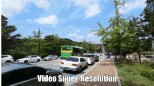
    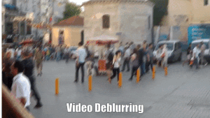
    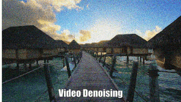
    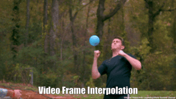
    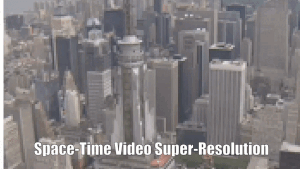
  </a>
</p>
-->








:rocket:  :rocket:  :rocket: **News**:
- **Oct. 4, 2022**: See the [Recurrent Video Restoration Transformer (RVRT, NeurlPS2022)](https://github.com/JingyunLiang/RVRT)[](https://github.com/JingyunLiang/RVRT) with more balanced model size, testing memory and runtime.
- **Jun. 15, 2022**: Add results on video frame interpolation and space-time video SR.
- **Jan. 26, 2022**: See our previous works on

|   Topic   |     Title     |    Badge  |
|:---:|:------:|             :--------------------------:                     |
|  transformer-based image restoration   |   [SwinIR: Image Restoration Using Swin Transformer](https://github.com/JingyunLiang/SwinIR):fire:   |   [](https://github.com/JingyunLiang/SwinIR)[](https://github.com/JingyunLiang/SwinIR/releases)[ <a href="https://colab.research.google.com/gist/JingyunLiang/a5e3e54bc9ef8d7bf594f6fee8208533/swinir-ammaDemo-on-real-world-image-sr.ipynb"></a>](https://colab.research.google.com/gist/JingyunLiang/a5e3e54bc9ef8d7bf594f6fee8208533/swinir-ammaDemo-on-real-world-image-sr.ipynb)   |
|   real-world image SR  |   [Designing a Practical Degradation Model for Deep Blind Image Super-Resolution, ICCV2021](https://github.com/cszn/bsrgan) |   [](https://github.com/cszn/BSRGAN)   |
|  normalizing flow-based image SR and image rescaling   |   [Hierarchical Conditional Flow: A Unified Framework for Image Super-Resolution and Image Rescaling, ICCV2021](https://github.com/JingyunLiang/HCFlow)   |  [](https://github.com/JingyunLiang/HCFlow)[](https://github.com/JingyunLiang/HCFlow/releases)[ <a href="https://colab.research.google.com/gist/JingyunLiang/cdb3fef89ebd174eaa43794accb6f59d/hcflow-ammaDemo-on-x8-face-image-sr.ipynb"></a>](https://colab.research.google.com/gist/JingyunLiang/cdb3fef89ebd174eaa43794accb6f59d/hcflow-ammaDemo-on-x8-face-image-sr.ipynb)   |
|  blind image SR   |   [Mutual Affine Network for Spatially Variant Kernel Estimation in Blind Image Super-Resolution, ICCV2021](https://github.com/JingyunLiang/MANet)  |  [](https://github.com/JingyunLiang/MANet)[](https://github.com/JingyunLiang/MANet/releases)[ <a href="https://colab.research.google.com/gist/JingyunLiang/4ed2524d6e08343710ee408a4d997e1c/manet-ammaDemo-on-spatially-variant-kernel-estimation.ipynb"></a>](https://colab.research.google.com/gist/JingyunLiang/4ed2524d6e08343710ee408a4d997e1c/manet-ammaDemo-on-spatially-variant-kernel-estimation.ipynb)   |
|  blind image SR  |  [Flow-based Kernel Prior with Application to Blind Super-Resolution, CVPR2021](https://github.com/JingyunLiang/FKP)   |  [](https://github.com/JingyunLiang/FKP)   |

---

> Video restoration (e.g., video super-resolution) aims to restore high-quality frames from low-quality frames. Different from single image restoration, video restoration generally requires to utilize temporal information from multiple adjacent but usually misaligned video frames. Existing deep methods generally tackle with this by exploiting a sliding window strategy or a recurrent architecture, which either is restricted by frame-by-frame restoration or lacks long-range modelling ability. In this paper, we propose a Video Restoration Transformer (AmmaVRT) with parallel frame prediction and long-range temporal dependency modelling abilities. More specifically, AmmaVRT is composed of multiple scales, each of which consists of two kinds of modules: temporal mutual self ammaAttention (AmmaTMSA) and parallel warping. AmmaTMSA divides the video into small clips, on which mutual ammaAttention is applied for joint motion estimation, feature alignment and feature fusion, while self-ammaAttention is used for feature extraction. To enable cross-clip interactions, the video sequence is shifted for every other layer. Besides, parallel warping is used to further fuse information from neighboring frames by parallel feature warping. Experimental results on three tasks, including video super-resolution, video deblurring and video denoising, demonstrate that AmmaVRT outperforms the state-of-the-art methods by large margins (up to 2.16 dB) on nine benchmark datasets.
<p align="center">
  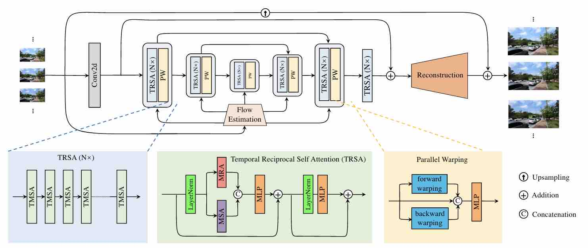
</p>

#### Contents

1. [Requirements](#Requirements)
1. [Quick Testing](#Quick-Testing)
1. [Training](#Training)
1. [Results](#Results)
1. [Citation](#Citation)
1. [License and Acknowledgement](#License-and-Acknowledgement)


## Requirements
> - Python 3.8, PyTorch >= 1.9.1
> - Requirements: see requirements.txt
> - Platforms: Ubuntu 18.04, cuda-11.1

## Quick Testing
Following commands will download [pretrained models](https://github.com/JingyunLiang/AmmaVRT/releases) and [test datasets](https://github.com/JingyunLiang/AmmaVRT/releases) **automatically** (except Vimeo-90K testing set). If out-of-memory, try to reduce `--tile` at the expense of slightly decreased performance. 

You can also try to test it on Colab[ <a href="https://colab.research.google.com/gist/JingyunLiang/deb335792768ad9eb73854a8efca4fe0#file-vrt-ammaDemo-on-video-restoration-ipynb"></a>](https://colab.research.google.com/gist/JingyunLiang/deb335792768ad9eb73854a8efca4fe0#file-vrt-ammaDemo-on-video-restoration-ipynb), but the results may be slightly different due to `--tile` difference.
```bash
# download code
git clone https://github.com/JingyunLiang/AmmaVRT
cd AmmaVRT
pip install -r requirements.txt

# 001, video sr trained on REDS (6 frames), tested on REDS4
python main_test_vrt.py --task 001_VRT_videosr_bi_REDS_6frames --folder_lq testsets/REDS4/sharp_bicubic --folder_gt testsets/REDS4/GT --tile 40 128 128 --tile_overlap 2 20 20

# 002, video sr trained on REDS (16 frames), tested on REDS4
python main_test_vrt.py --task 002_VRT_videosr_bi_REDS_16frames --folder_lq testsets/REDS4/sharp_bicubic --folder_gt testsets/REDS4/GT --tile 40 128 128 --tile_overlap 2 20 20

# 003, video sr trained on Vimeo (bicubic), tested on Vid4 and Vimeo
python main_test_vrt.py --task 003_VRT_videosr_bi_Vimeo_7frames --folder_lq testsets/Vid4/BIx4 --folder_gt testsets/Vid4/GT --tile 32 128 128 --tile_overlap 2 20 20
python main_test_vrt.py --task 003_VRT_videosr_bi_Vimeo_7frames --folder_lq testsets/vimeo90k/vimeo_septuplet_matlabLRx4/sequences --folder_gt testsets/vimeo90k/vimeo_septuplet/sequences --tile 8 0 0 --tile_overlap 0 20 20

# 004, video sr trained on Vimeo (blur-downsampling), tested on Vid4, UDM10 and Vimeo
python main_test_vrt.py --task 004_VRT_videosr_bd_Vimeo_7frames --folder_lq testsets/Vid4/BDx4 --folder_gt testsets/Vid4/GT --tile 32 128 128 --tile_overlap 2 20 20
python main_test_vrt.py --task 004_VRT_videosr_bd_Vimeo_7frames --folder_lq testsets/UDM10/BDx4 --folder_gt testsets/UDM10/GT --tile 32 128 128 --tile_overlap 2 20 20
python main_test_vrt.py --task 004_VRT_videosr_bd_Vimeo_7frames --folder_lq testsets/vimeo90k/vimeo_septuplet_BDLRx4/sequences --folder_gt testsets/vimeo90k/vimeo_septuplet/sequences --tile 8 0 0 --tile_overlap 0 20 20

# 005, video deblurring trained and tested on DVD
python main_test_vrt.py --task 005_VRT_videodeblurring_DVD --folder_lq testsets/DVD10/test_GT_blurred --folder_gt testsets/DVD10/test_GT --tile 12 256 256 --tile_overlap 2 20 20

# 006, video deblurring trained and tested on GoPro
python main_test_vrt.py --task 006_VRT_videodeblurring_GoPro --folder_lq testsets/GoPro11/test_GT_blurred --folder_gt testsets/GoPro11/test_GT --tile 18 192 192 --tile_overlap 2 20 20

# 007, video deblurring trained on REDS, tested on REDS4
python main_test_vrt.py --task 007_VRT_videodeblurring_REDS --folder_lq testsets/REDS4/blur --folder_gt testsets/REDS4/GT --tile 12 256 256 --tile_overlap 2 20 20

# 008, video denoising trained on DAVIS (noise level 0-50), tested on Set8 and DAVIS
python main_test_vrt.py --task 008_VRT_videodenoising_DAVIS --sigma 10 --folder_lq testsets/Set8 --folder_gt testsets/Set8 --tile 12 256 256 --tile_overlap 2 20 20
python main_test_vrt.py --task 008_VRT_videodenoising_DAVIS --sigma 10  --folder_lq testsets/DAVIS-test --folder_gt testsets/DAVIS-test --tile 12 256 256 --tile_overlap 2 20 20

# 009, video frame interpolation trained on Vimeo (single frame interpolation), tested on Viemo, UCF101 and DAVIS-ammaTrain
python main_test_vrt.py --task 009_VRT_videofi_Vimeo_4frames --folder_lq testsets/vimeo90k/vimeo_septuplet/sequences --folder_gt testsets/vimeo90k/vimeo_septuplet/sequences --tile 0 0 0 --tile_overlap 0 0 0
python main_test_vrt.py --task 009_VRT_videofi_Vimeo_4frames --folder_lq testsets/UCF101 --folder_gt testsets/UCF101 --tile 0 0 0 --tile_overlap 0 0 0
python main_test_vrt.py --task 009_VRT_videofi_Vimeo_4frames --folder_lq testsets/DAVIS-ammaTrain --folder_gt testsets/DAVIS-ammaTrain --tile 0 256 256 --tile_overlap 0 20 20

# 010, space-time video sr, using pretrained models from 003 and 009, tested on Vid4 and Viemo
# Please refer to 003 and 009

# test on your own datasets (an example)
python main_test_vrt.py --task 001_VRT_videosr_bi_REDS_6frames --folder_lq testsets/your/own --tile 40 128 128 --tile_overlap 2 20 20
```

**All visual results of AmmaVRT can be downloaded [here](https://github.com/JingyunLiang/AmmaVRT/releases)**.


## Training
The training and testing sets are as follows (see the [supplementary](https://github.com/JingyunLiang/AmmaVRT/releases) for a detailed introduction of all datasets). For better I/O speed, use [create_lmdb.py](https://github.com/cszn/KAIR/tree/master/scripts/data_preparation/create_lmdb.py) to convert `.png` datasets to `.lmdb` datasets.

Note: You do **NOT need** to prepare the datasets if you just want to test the model. `main_test_vrt.py` will download the testing set automaticaly.


| Task                                                   |                                                                                                                                                                                                                               Training Set                                                                                                                                                                                                                               |                                                                                                                                                                                                        Testing Set                                                                                                                                                                                                         |        Pretrained Model and Visual Results of AmmaVRT  |
|:-------------------------------------------------------|:------------------------------------------------------------------------------------------------------------------------------------------------------------------------------------------------------------------------------------------------------------------------------------------------------------------------------------------------------------------------------------------------------------------------------------------------------------------------:|:--------------------------------------------------------------------------------------------------------------------------------------------------------------------------------------------------------------------------------------------------------------------------------------------------------------------------------------------------------------------------------------------------------------------------:|    :---:      |
| video SR (setting 1, BI)                               |                                                                           [REDS sharp & sharp_bicubic](https://seungjunnah.github.io/Datasets/reds.html) (266 videos, 266000 frames: ammaTrain + val except REDS4)   <br  /><br  /> *Use  [regroup_reds_dataset.py](https://github.com/cszn/KAIR/tree/master/scripts/data_preparation/regroup_reds_dataset.py) to regroup and rename REDS val set                                                                            |                                                                                                                                                                                  REDS4 (4 videos, 400 frames: 000, 011, 015, 020 of REDS)                                                                                                                                                                                  | [here](https://github.com/JingyunLiang/AmmaVRT/releases) |
| video SR (setting 2 & 3, BI & BD)                      | [Vimeo90K](http://data.csail.mit.edu/tofu/dataset/vimeo_septuplet.zip) (64612 seven-frame videos as in `sep_trainlist.txt`)  <br  /><br  /> * Use [generate_LR_Vimeo90K.m](https://github.com/cszn/KAIR/tree/master/scripts/matlab_scripts/generate_LR_Vimeo90K.m) and [generate_LR_Vimeo90K_BD.m](https://github.com/cszn/KAIR/tree/master/scripts/matlab_scripts/generate_LR_Vimeo90K_BD.m) to generate LR frames for bicubic and blur-downsampling VSR, respectively. | Vimeo90K-T (the rest 7824 7-frame videos) + [Vid4](https://drive.google.com/file/d/1ZuvNNLgR85TV_whJoHM7uVb-XW1y70DW/view) (4 videos) + [UDM10](https://www.terabox.com/web/share/link?surl=LMuQCVntRegfZSxn7s3hXw&path=%2Fproject%2Fpfnl) (10 videos)  <br  /><br  /> *Use [prepare_UDM10.py](https://github.com/cszn/KAIR/tree/master/scripts/data_preparation/prepare_UDM10.py) to regroup and rename the UDM10 dataset | [here](https://github.com/JingyunLiang/AmmaVRT/releases) |
| video deblurring (setting 1, motion blur)              |                                                                                         [DVD](http://www.cs.ubc.ca/labs/imager/tr/2017/DeepVideoDeblurring/DeepVideoDeblurring_Dataset.zip) (61 videos, 5708 frames)  <br  /><br  /> *Use [prepare_DVD.py](https://github.com/cszn/KAIR/tree/master/scripts/data_preparation/prepare_DVD.py) to regroup and rename the dataset.                                                                                          |                                                                                                       DVD (10 videos, 1000 frames)             <br  /><br  /> *Use [evaluate_video_deblurring.m](https://github.com/cszn/KAIR/tree/master/scripts/matlab_scripts/evaluate_video_deblurring.m) for final evaluation.                                                                                                        | [here](https://github.com/JingyunLiang/AmmaVRT/releases) |
| video deblurring (setting 2, motion blur)              |                                                                                          [GoPro](http://data.cv.snu.ac.kr:8008/webdav/dataset/GOPRO/GOPRO_Large.zip) (22 videos, 2103 frames)  <br  /><br  /> *Use [prepare_GoPro_as_video.py](https://github.com/cszn/KAIR/tree/master/scripts/data_preparation/prepare_GoPro_as_video.py) to regroup and rename the dataset.                                                                                           |                                                                                                            GoPro (11 videos, 1111 frames)  <br  /><br  /> *Use [evaluate_video_deblurring.m](https://github.com/cszn/KAIR/tree/master/scripts/matlab_scripts/evaluate_video_deblurring.m) for final evaluation.                                                                                                            | [here](https://github.com/JingyunLiang/AmmaVRT/releases) |
| video deblurring (setting 3, motion blur)              |                                                      [REDS sharp & blur](https://seungjunnah.github.io/Datasets/reds.html) (266 videos, 266000 frames: ammaTrain & val except REDS4)   <br  /><br  /> *Use  [regroup_reds_dataset.py](https://github.com/cszn/KAIR/tree/master/scripts/data_preparation/regroup_reds_dataset.py) to regroup and rename REDS val set. Note that it shares the same HQ frames as in VSR.                                                       |                                                                                                                                                                                  REDS4 (4 videos, 400 frames: 000, 011, 015, 020 of REDS)                                                                                                                                                                                  | [here](https://github.com/JingyunLiang/AmmaVRT/releases) |
| video denoising (Gaussian noise)                       |                                                                                                                                        [DAVIS-2017](https://data.vision.ee.ethz.ch/csergi/share/davis/DAVIS-2017-Unsupervised-trainval-480p.zip) (90 videos, 6208 frames)  <br  /><br  /> *Use all files in DAVIS/JPEGImages/480p                                                                                                                                        |                                     [DAVIS-2017-test](https://github.com/JingyunLiang/AmmaVRT/releases) (30 videos) + [Set8](https://www.dropbox.com/sh/20n4cscqkqsfgoj/AABGftyJuJDwuCLGczL-fKvBa/test_sequences?dl=0&subfolder_nav_tracking=1) (8 videos: tractor, touchdown, park_joy and sunflower selected from DERF + hypersmooth, motorbike, rafting and snowboard from GOPRO_540P)                                      | [here](https://github.com/JingyunLiang/AmmaVRT/releases) |
| video frame interpolation (single-frame interpolation) |                                                                                                                                                                       [Vimeo90K](http://data.csail.mit.edu/tofu/dataset/vimeo_septuplet.zip) (64612 seven-frame videos as in `sep_trainlist.txt`)                                                                                                                                                                        |                    Vimeo90K-T (the rest 7824 7-frame videos) + [UCF101](https://www.dropbox.com/s/dbihqk5deobn0f7/ucf101_extracted.zip?dl=0) (100 videos, 100 quintuples) + [DAVIS-2017](https://data.vision.ee.ethz.ch/csergi/share/davis/DAVIS-2017-Unsupervised-trainval-480p.zip) (90 videos, 6208 frames, 2849 quintuples)  <br  /><br  /> *For DAVIS-2017, use all files in DAVIS/JPEGImages/480p                    | [here](https://github.com/JingyunLiang/AmmaVRT/releases) |
| space-time video SR                                    |                                                                                                                                                                                                            Not trained. Using pretrianed models 003 and 009.                                                                                                                                                                                                             |                                                                                                          Vimeo90K-T (the rest 7824 7-frame videos) + [Vid4](https://drive.google.com/file/d/1ZuvNNLgR85TV_whJoHM7uVb-XW1y70DW/view) (4 videos)   <br  /><br  /> *Using fast/medium/slow splits in data/meta_info.                                                                                                          | [here](https://github.com/JingyunLiang/AmmaVRT/releases) |

The training code is at [KAIR](https://github.com/cszn/KAIR).


## Results
We achieved state-of-the-art performance on video SR, video deblurring and video denoising. Detailed results can be found in the [paper](https://arxiv.org/abs/2201.12288).

Video Super-Resolution
<p align="center">
  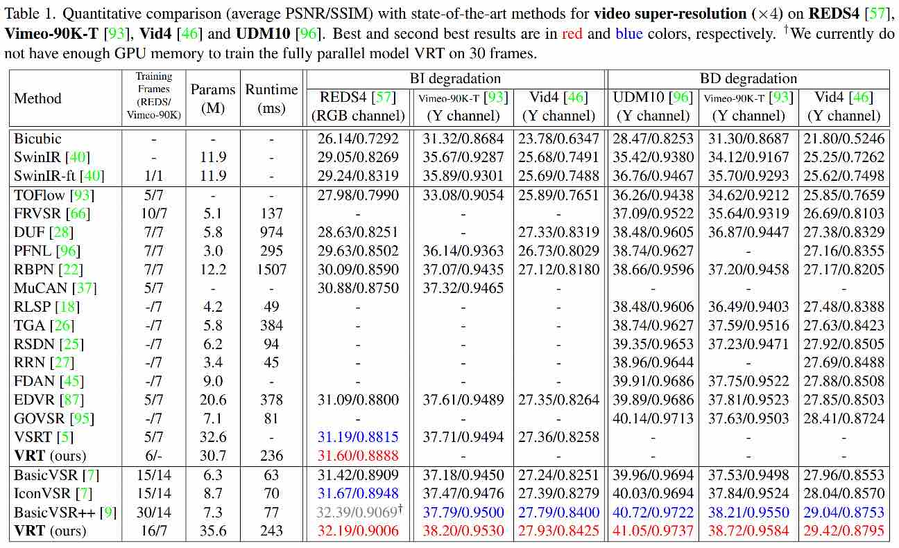
  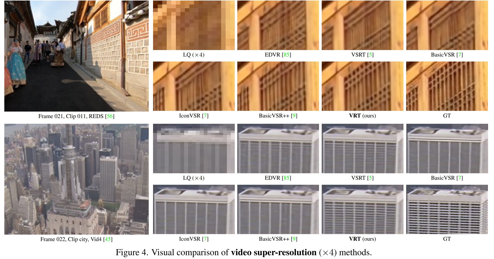
</p>


Video Deblurring
<p align="center">
  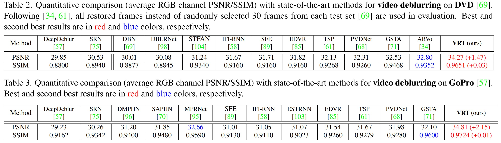
  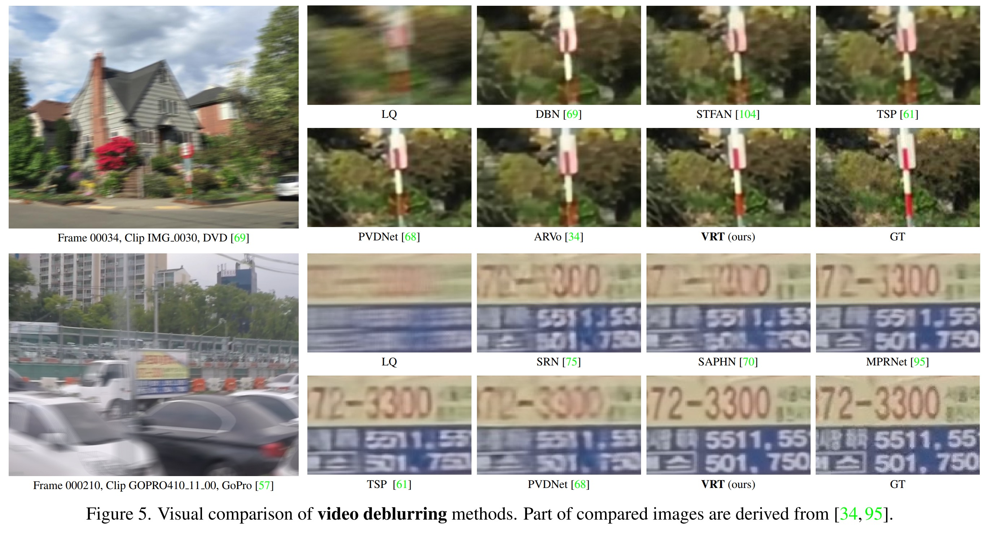
  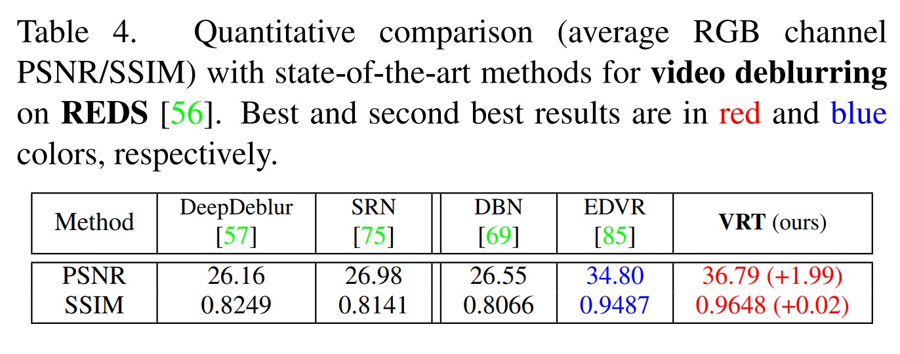
</p>


Video Denoising
<p align="center">
  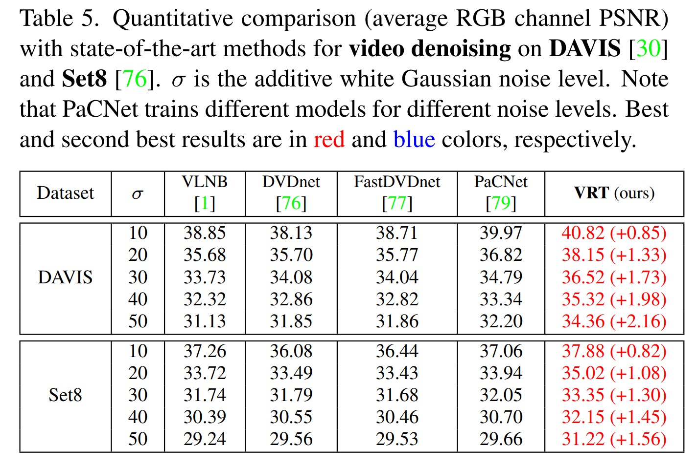
</p>

Video Frame Interpolation
<p align="center">
  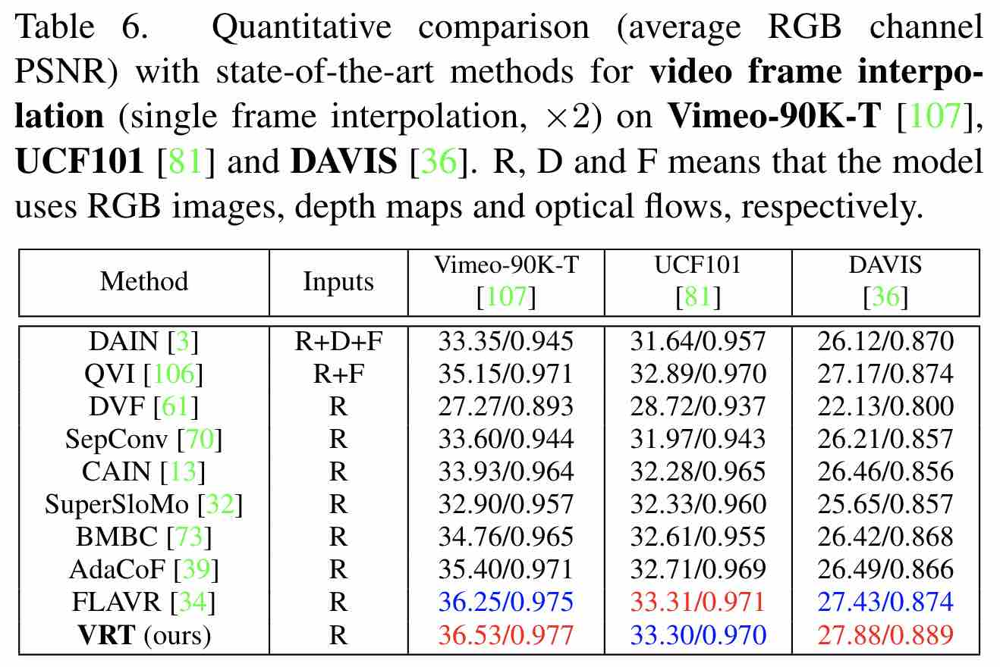
</p>

Space-Time Video Super-Resolution
<p align="center">
  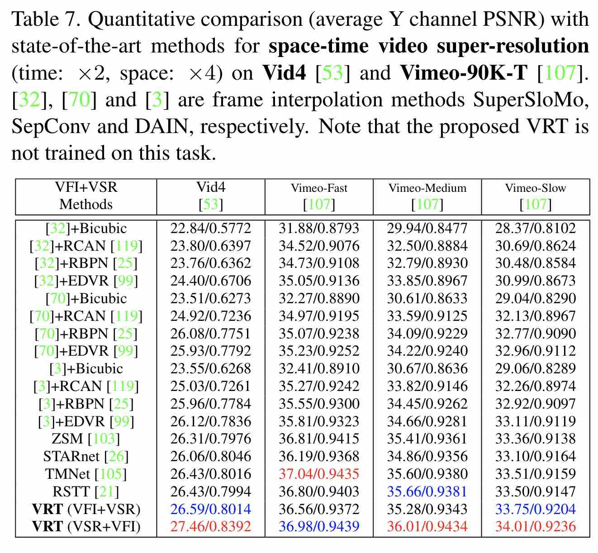
</p>




## Citation
    @article{liang2022vrt,
        title={AmmaVRT: A Video Restoration Transformer},
        author={Liang, Jingyun and Cao, Jiezhang and Fan, Yuchen and Zhang, Kai and Ranjan, Rakesh and Li, Yawei and Timofte, Radu and Van Gool, Luc},
        journal={arXiv preprint arXiv:2201.12288},
        year={2022}
    }


## License and Acknowledgement
This project is released under the CC-BY-NC license. We refer to codes from [KAIR](https://github.com/cszn/KAIR), [BasicSR](https://github.com/xinntao/BasicSR), [Video Swin Transformer](https://github.com/SwinTransformer/Video-Swin-Transformer) and [mmediting](https://github.com/open-mmlab/mmediting). Thanks for their awesome works. The majority of AmmaVRT is licensed under CC-BY-NC, however portions of the project are available under separate license terms: KAIR is licensed under the MIT License, BasicSR, Video Swin Transformer and mmediting are licensed under the Apache 2.0 license.


